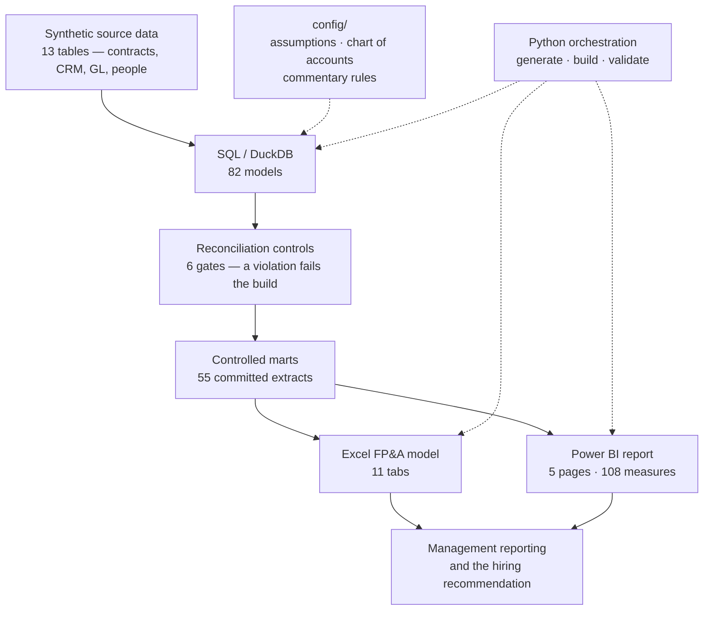

# SaaS FP&A Operating Model & Reporting Stack

**Independent portfolio case study using a synthetic B2B SaaS company and synthetic data.**

An integrated FP&A environment for *Helio Systems, Inc.* — a $33M-ARR B2B SaaS business selling
field-service software to commercial contractors. It connects customer-level ARR movements,
retention economics, GTM capacity and pipeline, driver-based forecasting, the P&L, scenarios and
cash runway, and ends in an executive reporting pack and a management recommendation.

It is built around one reporting cycle — the **FY2026 Q2 Board reforecast**, prepared at 30 June
2026 — and one decision:

> **Can Helio fund additional sales capacity to re-accelerate growth without breaching its
> 24-month minimum cash-runway policy?**

---

## What the analysis found

**Recommendation: do not add sales capacity ahead of pipeline. The constraint is demand, not
seats — and the hiring case that closes the capacity gap buys very little growth for the cash it
consumes.**

| Finding | Evidence |
|---|---|
| FY2026 lands **$2.8M (−7.4%)** below the Board's Exit ARR budget | Dec-26 Base **$34.8M** vs Budget **$37.6M** |
| **New Logo ARR is essentially the whole gap** — down $2.8M, or **−46.6%** against budget | The retained base is healthy: NRR **101.8%** |
| **Pipeline, not capacity, is what binds.** Reps are not the shortage | **15 of 18** H2 2026 segment-months are pipeline-bound; H2 capacity **$2.9M** against pipeline-supported **$1.2M** |
| The Base plan **holds the Board floor**; the Bear case **breaches it** | Base **25.6 months**, Bear **23.5**, floor **24.0** |
| Closing the capacity gap is *affordable* but **not attractive** | Full Capacity-Close: 4 hires, **$637k** of cash for **$147k** of Dec-2027 ARR, runway down to 24.7 months |

Affordability and attractiveness are answered separately and deliberately. A plan can clear the
runway policy and still be a poor use of cash — here it does, and the report says so on its own
page rather than burying it.


*The whole management problem on one screen: where FY2026 lands, what moved it, and whether it is
fundable.*

---

## Reporting stack

Two presentation layers sit over one controlled analytical core. Neither re-implements a business
rule: every calculation lives in SQL and is reconciled before anything displays it.

**Power BI executive report** — five pages over a 27-table semantic model, committed as a text
**Power BI Project (PBIP)** rather than a binary `.pbix`, so every measure, relationship and visual
is reviewable in a diff.
→ [`powerbi/`](powerbi/) · [measure library](powerbi/measures.md) · [design notes](docs/powerbi_executive_report.md)

The five pages are the Board conversation in order. Page 1 is above; three more are worth showing.

### Why adding reps would not close the gap

Sales believed they were capacity-constrained. Modelling capacity and pipeline as *separate*
constraints — and forecasting the lesser of the two — shows the opposite: capacity runs above
pipeline in every forecast month, so the shortfall is demand, not seats. This page is why the
hiring recommendation is negative.


### Is the recurring base healthy?

Monthly ARR movement with the forecast line starting exactly where the actual stops, TTM retention
by segment, and forward renewal exposure. It establishes that the problem is new business: NRR
holds near 102%, and the SMB retention drag is visible rather than blended away.


### Affordable, or worth doing?

The page is split deliberately: **A. financial affordability** against the Board floor, and
**B. economic attractiveness** on the FY2027 horizon. Full Capacity-Close clears the floor at 24.7
months and still buys $147k of ARR for $637k of cash — two different answers to two different
questions.


### What the P&L and the cost base actually do

The management P&L across four fiscal years, the Budget-versus-Base scorecard with centrally
derived favourability, the operating-income bridge, and the accounting panel where deferred revenue
and capitalised commissions sit beneath the commercial metrics.


**Excel FP&A operating model** — eleven presentation tabs generated from the same marts. No VBA,
no macros, no external links, no manual step after the build, and no password, so every formula is
inspectable. → [`excel/`](excel/) · [design notes](docs/excel_operating_model.md)

Where Power BI is the executive interface, Excel is the working one: it shows the arithmetic a
finance team would want to interrogate line by line.

### The management view, with the working visible

Ten KPI tiles, the Budget-versus-Base table with centrally derived favourability, a decision panel
in which every verdict is a formula over an approved mart, and the rules-generated commentary —
none of it typed in by hand.


### The bridge, reconciled end to end

The Budget-to-Base operating income walk with a running balance and a residual that must read zero,
gross margin reported in basis points rather than as a bare percentage-point difference, and the
revenue decomposition beneath it.


---

## Headline metrics

Every figure traces to the committed marts in [`data/marts/`](data/marts/); sources are listed in
the [case study](docs/portfolio_case_study.md).

| | | | |
|---|---|---|---|
| Jun-26 ARR (actual) | **$33.0M** | NRR (TTM) | **101.8%** |
| Dec-26 Exit ARR (Base) | **$34.8M** | GRR (TTM) | **89.6%** |
| Dec-26 Exit ARR (Budget) | **$37.6M** | Logo retention (TTM) | **83.4%** |
| FY2026 revenue | **$32.8M** | CAC payback | **21–35 months** by segment |
| FY2026 gross margin | **78.4%** | Net ARR Sales Efficiency (FY2025) | **0.41** |
| FY2026 operating loss | **($5.7M)** | Magic Number (FY2025) | **0.43** |
| Base policy runway | **25.6 months** | Bear policy runway | **23.5 months** |

CAC payback of 21 to 35 months and a Magic Number of 0.43 are bottom-quartile for SaaS. The model
reports them that way rather than flattering the picture, and that is precisely why the hiring
recommendation is negative.

---

## Architecture



**The analytical layer owns every business calculation.** Excel does variance, subtotals, bridge
running balances and lookups; DAX does semi-additive balances and ratios of aggregates. Neither
invents a number.

### How the finance logic flows

Customer activity → **ARR movements** (new, expansion, contraction, churn, reactivation, classified
at customer grain) → **retention and the renewal base** → **GTM capacity and pipeline** → the
**driver-based reforecast** → **P&L and headcount** → **cash runway against the Board floor** →
the **hiring decision** → **management reporting and commentary**.

Each step constrains the next. Capacity does not become bookings unless pipeline supports it;
bookings do not become ARR until they close; ARR does not become cash until it is billed. That
chain is why the answer to the hiring question is not simply "runway allows it".

---

## What it demonstrates

**SaaS metrics** — ARR waterfall at customer grain · NRR / GRR / logo retention as ratios of
aggregates, never averages of ratios · acquisition cohorts · available-to-renew and renewal
outcomes · expansion, contraction and churn kept apart · CAC, CAC payback, Magic Number and Net
ARR Sales Efficiency, shown as a labelled pair and never combined into one number

**FP&A** — Board budget against Q2 reforecast · driver-based forecasting · Bear / Base / Bull
scenarios · management P&L · headcount rollforward · Budget-to-Base variance bridges with visible
residuals · deterministic management commentary · policy cash runway and a runway-constrained
hiring decision

**GTM finance** — rep ramp and quota-carrying capacity · pipeline coverage · pipeline-supported
bookings · `LEAST(capacity, pipeline)` as the binding constraint · CRM-to-ARR reconciliation

**Accounting and controls** — bookings, billings, ARR and revenue kept distinct · deferred-revenue
rollforward · ASC 340-40 capitalised commissions · six reconciliation gates that fail the build

---

## Controls and reconciliation

This is a controlled model, not a dashboard over a spreadsheet.

- **Six reconciliation gates** run on every build — ARR, retention bounds, GTM, forecast, bridges
  and accounting. A violation exits non-zero and nothing downstream runs.
- **The ARR waterfall ties** at customer grain, and every Budget-to-Base bridge carries a visible
  residual that reads zero.
- **The Excel workbook** is checked by 127 assertions, including every displayed value recomputed
  from the marts in Python.
- **The Power BI project** passes 519 static assertions and Microsoft's own PBIR validator with no
  errors or warnings. Its DAX ships with **157 expected values generated from the marts**, so the
  semantic model can be *verified* against SQL rather than trusted.
- **412 tests** run on every build, including mutation tests that deliberately break each guard to
  prove it fails. A guard that has never been made to fail is not a guard.

Static checks do not prove that a report renders, and they are kept separate from the thing that
does. The Power BI project has been **opened and accepted in Power BI Desktop** — the model
refreshes across all 27 tables, all five pages render, and the screenshots above are captured from
that build. Reaching it took five rounds of defects that every static check had passed, and
[the phase document](docs/powerbi_executive_report.md) records each one rather than presenting a
clean story after the fact.

---

## Review this project in 5 minutes

1. **The recommendation** — [what the analysis found](#what-the-analysis-found), above.
2. **The case study** — [`docs/portfolio_case_study.md`](docs/portfolio_case_study.md): situation,
   approach, findings and decision.
3. **The measure library** — [`powerbi/measures.md`](powerbi/measures.md): every DAX measure with
   its source mart, the equivalent SQL, and its filter-context behaviour.
4. **The answer key** —
   [`expected_measure_results.csv`](powerbi/validation/expected_measure_results.csv): 157 values
   computed from the marts that the DAX has to match.
5. **The Excel model** — [`docs/excel_operating_model.md`](docs/excel_operating_model.md), which
   carries its own five-minute review route.

## Go deeper

[ARR engine](docs/arr_engine.md) · [retention and renewals](docs/retention_renewals.md) ·
[GTM finance](docs/gtm_finance.md) · [forecast, scenarios and runway](docs/forecast_runway.md) ·
[budget bridges and commentary](docs/bridge_commentary.md) ·
[accounting](docs/accounting_enhancements.md) ·
[Excel operating model](docs/excel_operating_model.md) ·
[Power BI executive report](docs/powerbi_executive_report.md) ·
[data dictionary](docs/data_dictionary.md) ·
[generation methodology](docs/generation_methodology.md) ·
[frozen specification](docs/PHASE1_SPEC.md)

For interviews and positioning: [interview guide](docs/interview_guide.md) ·
[project positioning](docs/project_positioning.md)

---

## Tech stack

**SQL / DuckDB** — 82 models, the single owner of business logic ·
**Python** — data generation, orchestration, validation, and the generators that write the Excel
workbook and the Power BI project ·
**Excel** — a generated operating model, formulas only ·
**Power BI** — a source-controlled semantic model in **TMDL** and a report in **PBIR**, committed
as text ·
**Git**

Local-first throughout: no cloud warehouse, no gateway, no workspace, no external service.

## Reproduce it

```bash
pip install -r requirements.txt
python -m src.build
```

The build generates the source data, validates it, builds the DuckDB layer, runs the controls,
exports the marts, regenerates the Excel workbook and the Power BI project, runs their validation
suites, and runs the tests. It takes roughly two minutes and is deterministic: deleting
`data/raw/` and rebuilding reproduces the committed CSVs byte for byte.

Individual layers: `python -m src.run_sql` · `python -m src.build_excel_model` ·
`python -m src.build_powerbi` · `python -m src.validate_powerbi`

To open the Power BI project, enable **Power BI Project (.pbip)** under Desktop's preview features,
open `powerbi/Helio_Executive_Report.pbip`, set the `RepoRoot` parameter to your clone path, and
refresh. It is committed empty on purpose — an absolute path from one machine has no place in a
public repository.

---

## About the data

Helio Systems, Inc. is fictional and every figure is synthetically generated for this case study.
No confidential, proprietary or employer information was used, referenced or derived from. The
financial structure, metric definitions and reporting conventions follow publicly documented SaaS
practice, and the generator is calibrated so the business behaves like a real one: churn
concentrates at contract anniversaries, renewals are seasonal, rep attainment disperses, and not
every metric hits benchmark.

[Licence](LICENSE) · [changelog](CHANGELOG.md)
