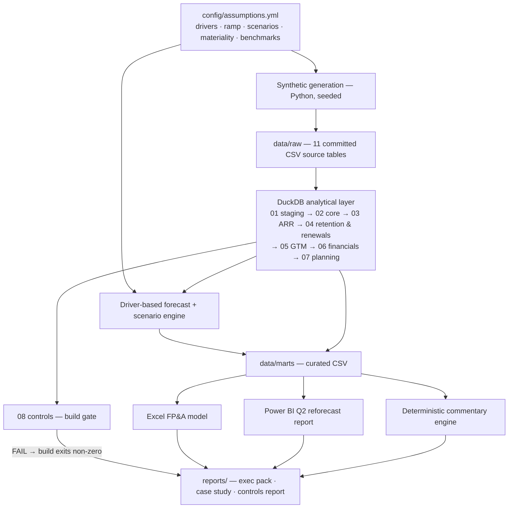

# FINAL APPROVED PHASE 1 SPECIFICATION — v3 (FROZEN)
## Helio Systems, Inc. — FY2026 Q2 Board Reforecast
### A SaaS FP&A operating model, analytics layer and reporting stack

**Status:** Phase 1, revision 3. **Frozen.** Supersedes v1 and v2 entirely.
**Rule:** Single source of truth. Nothing outside this document is built. No Phase 2 without explicit approval.

---

## REVISION LOG — v2 → v3

| # | Change | Effect |
|---|---|---|
| R12 | **Net Sales Efficiency and classic Magic Number separated** as distinct metrics with distinct denominators and distinct benchmark conventions. | §8.4 rewritten. Anchor set adds Magic Number 0.34 alongside Net Sales Efficiency 0.42. |
| R13 | **Commissions demoted** to a secondary accounting-fluency module. Removed from the never-cut list. Guidance corrected to **ASC 340-40** within the ASC 606 framework; IFRS 15 mentioned in documentation only. | §8.6, §11, §13. |
| R14 | **Benchmarking made selective.** Six metrics carry dashboard benchmarks; the rest are documented without comparison. | §9, §12. |
| R15 | **ARR movement classification is binding at customer-month grain**, after aggregating subscription records. Product-level movement analysis exists separately and is explicitly non-tying on categories. | §8.2 rewritten. |
| R16 | **Implementation reordered** so the core management question is solved before accounting depth and presentation. Minimum shippable moves to end of Phase 6 and now includes GTM capacity, CRM-to-ARR and the runway-constrained hiring scenario. | §11 rewritten. |
| R17 | **Commit-count and calendar-spreading requirements removed.** | §15. |
| R18 | **Repository repositioned as the FY2026 Q2 Board Reforecast case study**, making the 30 June 2026 reporting date self-evidently intentional. | §1, §2.2, §3. |
| R19 | **Recruiter-facing artifact hierarchy rewritten** to five named artifacts. Deferred revenue and commission capitalisation demoted to evidence-of-depth. | §1, §10, §12. |

Scope is not expanded in v3. Net effort is unchanged at **60–74 hours**.

---

## 0. GOVERNING CONSTRAINTS

1. **Interview-defensibility filter.** If the owner cannot explain a component in 90 seconds, it does not ship.
2. **Depth over breadth.** Uniform 70% depth is the signature of a generated project.
3. **Derive, never fabricate.** Every published insight must be reproducible by query.
4. **Reconcile or delete.** Outputs that don't tie are removed, not caveated.
5. **Two-command setup.** `pip install -r requirements.txt`, then `python -m src.build`.
6. **Readable without running.** Generated data, curated marts, screenshots and reports are committed.
7. **State the definition before the number.** Where a SaaS metric has more than one accepted definition, the chosen one is declared and the benchmark is matched to it or omitted.

---

## 1. NAME, POSITIONING AND RECRUITER HIERARCHY

**Repository:** `saas-fpa-operating-model`

**GitHub description:**
> FY2026 Q2 Board reforecast for a synthetic $33M-ARR B2B SaaS company — ARR waterfall, renewal forecasting, GTM capacity, CRM-to-ARR reconciliation and runway-constrained hiring analysis. SQL / DuckDB, Python, Excel, Power BI.

**README H1 and subtitle:**
> # Helio Systems — FY2026 Q2 Board Reforecast
> ### A working SaaS FP&A operating model, analytics layer and reporting stack. Synthetic data.

**Positioning sentence (first body line, before any diagram or tech list):**
> Helio is $1.9M behind its FY2026 ARR plan and the CRO has asked for eight more account executives. This repository is the analysis behind the answer.

### 1.1 Recruiter-facing artifact hierarchy — BINDING

The README presents artifacts in exactly this order. Screenshots appear in this order. The `docs/` index lists them in this order.

| Rank | Artifact | What it proves |
|---|---|---|
| **1** | **Executive Q2 Reforecast** | Can produce a Board-grade reforecast package with a defensible position |
| **2** | **ARR, Retention & Renewal Forecast** | Understands recurring-revenue mechanics forward and backward |
| **3** | **GTM Capacity & Pipeline** | Can connect sales hiring to bookings to plan attainment |
| **4** | **CRM-to-ARR Reconciliation** | Has dealt with the systems reality of SaaS finance |
| **5** | **Runway-Constrained Hiring Scenario** | Turns analysis into a funding decision |

**Evidence of depth — visible, not headline.** Deferred revenue rollforward, contract-level revenue recognition, commissions and ASC 340-40 capitalisation, the controls suite, and the test suite are presented in a single "Financial controls and accounting depth" section positioned *after* the five artifacts above. They are linked, screenshotted where useful, and never given a top-level heading that competes with the five.

**Keyword strip** (one line, plain text): `SaaS FP&A · ARR / NRR / GRR · Renewal Forecasting · GTM Capacity · Driver-Based Planning · Scenario Analysis · SQL · Power BI · Financial Controls`

**Hard README rules:**
- First screenshot within the first screen; it is the Executive Q2 Reforecast page.
- No architecture diagram until after the business problem, the five artifacts and the key insights.
- Never use "platform" in prose. Never use "AI-powered."
- Maximum 3 badges: CI status, Python version, licence.
- Metric definitions live in `docs/`; the README links to them.
- No emoji in headings.

---

## 2. COMPANY PROFILE

### 2.1 Identity

| Attribute | Value |
|---|---|
| Name | **Helio Systems, Inc.** |
| Product | Cloud field-service management software for commercial contractors |
| HQ | Denver, Colorado |
| Markets | United States and Canada |
| Founded | 2018 |
| Stage | Series C, $40M raised February 2024 (total raised $71M) |
| Fiscal year | Calendar |
| Reporting | Single entity, USD, no FX |

**Customer naming convention (binding).** Names must read as real commercial contracting firms: `[Surname or Place] [Trade] [Suffix]` — Delgado Electric, Tri-State Mechanical, Harrow Facilities Group, Cascade Plumbing & Heating, Brightline Building Services. Curated seeded word lists in `config/name_lists.yml`. **Never** "Acme," "TechFlow," "Solutions Inc.," "Global," "Innovate," or any default a language model would reach for.

### 2.2 Timeline and framing

The repository is explicitly framed as a **point-in-time Board reporting cycle**, not a general-purpose dashboard. This is why the reporting date is fixed and why a single reforecast version exists.

| Element | Period |
|---|---|
| Customer acquisition history | Jan 2019 – Jun 2026 |
| Monthly fact tables | **Jan 2024 – Jun 2026 (30 months actual)** |
| FY2026 Board-approved budget | Jan – Dec 2026, locked Dec 2025 |
| **Reporting position** | **Month-end close, 30 June 2026 — FY2026 Q2** |
| Reforecast | Jul 2026 – Dec 2027 (18 months), version `FY2026-Q2-Reforecast` |
| Board meeting | September 2026 |

State the framing in the README opening and in `docs/business_case.md`: *"This repository reproduces one FP&A reporting cycle — the FY2026 Q2 reforecast package prepared for Helio's September Board meeting. Every artifact is dated 30 June 2026 because that is the close it belongs to."*

### 2.3 Anchor financials — BINDING and internally reconciled

Tolerance: ±2% on ARR and revenue, ±3 logos, ±1pt on rates. Tune generator parameters, never the anchors. Changing one anchor requires re-solving the set.

**ARR**

| Date | ARR | YoY growth |
|---|---|---|
| 1 Jan 2024 (opening) | $18.5M | — |
| 31 Dec 2024 | $24.2M | +30.8% |
| 31 Dec 2025 | $30.1M | +24.4% |
| 30 Jun 2026 (actual) | $32.8M | +19.7% |
| 31 Dec 2026 (budget) | $37.5M | +24.6% |
| 31 Dec 2026 (Q2 reforecast) | **$35.6M** | +18.3% |

**FY2025 ARR waterfall — the reconciling set**

| Component | $M |
|---|---|
| Beginning ARR (1 Jan 2025) | 24.2 |
| New logo ARR | +5.0 |
| Expansion ARR | +4.4 |
| Reactivation ARR | +0.2 |
| Contraction ARR | (0.9) |
| Churn ARR | (2.8) |
| **Ending ARR (31 Dec 2025)** | **30.1** |
| Net new ARR | 5.9 |

Of the $2.8M churn, ~$0.3M is FY2025-acquired customers, outside the TTM retention cohort. Of the $4.4M expansion, ~$0.2M is on within-year new logos. These splits are what make the waterfall and the retention metrics tie.

**Customer base at 31 Dec 2025** — 880 logos, $30.1M ARR, blended ARPA $34.2k

| Segment | Logos | ARR | ARPA | FY2025 new logos | New-logo ACV |
|---|---|---|---|---|---|
| SMB | 560 | $4.76M | $8.5k | 178 | $9.0k |
| Mid-Market | 265 | $13.78M | $52.0k | 47 | $45.0k |
| Enterprise | 55 | $11.55M | $210.0k | 7 | $185.0k |
| **Total** | **880** | **$30.09M** | | **232** | **$21.6k** |

Segmentation is by **customer employee count**: SMB < 50, Mid-Market 50–499, Enterprise 500+. Stated explicitly — segmenting by ARR makes retention analysis circular.

**Customer concentration at 30 Jun 2026:** top 10 = 14.2% of ARR; largest single customer 2.4%.

**Retention — TTM at 30 Jun 2026** (must emerge from the generator)

| Segment | Logo retention | GRR | NRR |
|---|---|---|---|
| SMB | 79% | 75% | 84% |
| Mid-Market | 91% | 88% | 102% |
| Enterprise | 96% | 93% | 118% |
| **Blended** | **84%** | **87.5%** | **105%** |

GRR and NRR blended are ARR-weighted; logo retention is logo-weighted. Blended NRR was 103% at Dec 2025; the rise reflects two Enterprise expansions in Q2 2026.

**FY2025 P&L**

| Line | $M | % of revenue |
|---|---|---|
| Subscription revenue | 26.6 | 97.1% |
| Professional services revenue | 0.8 | 2.9% |
| **Total revenue** | **27.4** | **100.0%** |
| Subscription cost of revenue | 5.7 | |
| Services cost of revenue | 0.7 | |
| **Total cost of revenue** | **6.4** | **23.4%** |
| **Gross profit** | **21.0** | **76.6%** |
| Sales & Marketing | 14.2 | 51.8% |
| Research & Development | 9.1 | 33.2% |
| General & Administrative | 5.1 | 18.6% |
| **Operating expense** | **28.4** | **103.6%** |
| **EBITDA** | **(7.4)** | **(27.0%)** |

Subscription gross margin 78.6%; services gross margin 12.5%. Services is run near break-even as an adoption lever, not a profit centre — stated in docs.

**FY2025 quarterly subscription revenue and S&M** (required for the two efficiency metrics)

| Quarter | Subscription revenue $M | S&M $M |
|---|---|---|
| Q4 2024 | 5.90 | 3.40 |
| Q1 2025 | 6.15 | 3.50 |
| Q2 2025 | 6.50 | 3.55 |
| Q3 2025 | 6.85 | 3.60 |
| Q4 2025 | 7.10 | 3.55 |
| **FY2025 total** | **26.60** | **14.20** |

**Derived FY2025 metrics**

| Metric | Value | Note |
|---|---|---|
| Net new ARR | $5.9M | |
| Net burn | $8.0M | |
| Burn multiple | 1.36x | |
| Rule of 40 | (2.6%) | 24.4% growth − 27.0% EBITDA margin |
| ARR per FTE | $158k | |
| **Net Sales Efficiency** | **0.42** | Net new ARR ÷ prior-period S&M |
| **Magic Number (classic)** | **0.34** | Annualised QoQ subscription revenue growth ÷ prior-quarter S&M, FY2025 average |
| New-customer CAC | $29.9k | |
| CAC per $1 new-logo ARR | $1.39 | |
| **CAC payback, blended** | **21.7 months** | Gross-margin adjusted |

The gap between 0.42 and 0.34 is expected and must be explained in `docs/metric_definitions.md`: ARR is a point-in-time forward measure, recognised revenue lags it, and in a decelerating business the revenue-based measure reads lower. A candidate who reports one number without naming which definition produced it has not understood the metric.

**Unit economics by segment**

| Segment | CAC | New ARPA | CAC payback | NRR | Read |
|---|---|---|---|---|---|
| SMB | $8.0k | $9.0k | **14 months** | 84% | Cheap to buy, doesn't stay |
| Mid-Market | $63k | $45k | **22 months** | 102% | Balanced |
| Enterprise | $366k | $185k | **31 months** | 118% | Expensive to buy, compounds |

New-logo acquisition S&M = $6.94M, **48.9% of total S&M**, derived bottom-up per §8.4.

**Headcount at 30 Jun 2026: 198 FTE**

| Function | FTE | P&L |
|---|---|---|
| Sales | 44 | S&M |
| Marketing | 18 | S&M |
| Customer Success | 26 | 60% COGS / 40% S&M |
| Support & Cloud Ops | 15 | COGS |
| Professional Services | 8 | Services COGS |
| Engineering | 52 | R&D |
| Product & Design | 22 | R&D |
| G&A | 21 | G&A |

Sales detail: **14 quota-carrying AEs** (SMB 4, Mid-Market 6, Enterprise 4), 12 SDRs, 5 Solutions Engineers, 6 Sales Ops/Enablement, 7 leadership.
Voluntary attrition: 18% blended, 26% Sales, 11% G&A. Drives backfill requisitions.

**Cash and runway at 30 Jun 2026**

| Item | Value |
|---|---|
| Cash and equivalents | **$21.8M** |
| TTM average monthly net burn | $0.68M |
| Reforecast FY2027 average monthly net burn | $0.85M |
| **Forward runway** | **25.6 months** |
| Trailing-burn runway (contrast only) | 32.1 months |
| **Board runway floor** | **24 months** |

### 2.4 Products and contracts

**Products (3):** Helio Core (platform, per seat), Helio Dispatch (add-on, per seat), Helio Insights (analytics add-on, usage-tiered with committed minimum). Attach: Dispatch 48%, Insights 22%, skewed to Mid-Market and Enterprise.

| Contract type | Term | Billing | Segment skew | Share of ARR |
|---|---|---|---|---|
| Monthly | Month-to-month | Monthly in arrears | SMB | 11% |
| Annual | 12 months | Annual in advance (78%) / quarterly in advance (22%) | All | 61% |
| Multi-year | 24 or 36 months | Annual in advance | Enterprise | 28% |

Average discount to list: 8% SMB, 14% Mid-Market, 22% Enterprise. ACV is net of discount.

### 2.5 Contract-anniversary churn mechanics — BINDING

| Contract type | Churn timing | Contraction timing | Expansion timing |
|---|---|---|---|
| Monthly | Any month | Any month | Any month |
| Annual | **Anniversary month only**, ≤6% early termination | **Anniversary month only** | Any month; co-termed and prorated |
| Multi-year | **End-of-term month only**, ≤4% early termination | End of term only | Any month; co-termed |

Consequences the generator must produce:
- **Renewal seasonality** — ATR concentrates in Q1 (28%) and Q4 (31%). Monthly gross churn ranges roughly $110k–$390k. Churn is lumpy, never smooth.
- **Price uplift at renewal** — 3–5% on renewing annual and multi-year contracts, tracked as a distinct expansion sub-type.
- **Mid-term expansion is prorated and co-terminous** — full annualised amount lands in ARR immediately; billing is prorated.

---

## 3. BUSINESS PROBLEM

You are Senior Financial Analyst, FP&A at Helio Systems, reporting to the VP Finance. Helio closed a $40M Series C in February 2024 on a plan to reach $50M ARR by end of FY2027 while holding at least 24 months of runway.

At the FY2026 Q2 close, growth has decelerated from 30% to 20%, the FY2026 exit reforecast is $1.9M below the Board-approved budget, CAC payback has drifted past 21 months, and the CRO has requested funding for eight additional AEs in H2.

The Board meets in September. **Can Helio fund the sales capacity required to re-accelerate growth without breaching the 24-month runway floor, and if not, what is the alternative?**

This repository is the Q2 reforecast package prepared to answer that.

---

## 4. MANAGEMENT QUESTIONS

| # | Question | Answered by |
|---|---|---|
| 1 | Are we tracking to the ARR and revenue plan, and where is the gap? | ARR waterfall; budget-to-reforecast bridge; executive reforecast |
| 2 | Where is ARR growth coming from, and how has the mix shifted? | ARR waterfall by movement type, segment, product |
| 3 | Which segments retain, and what is at risk at the next renewal? | Retention cohorts; renewal base / ATR; churn detail |
| 4 | Are we acquiring efficiently, and how does that differ by segment? | CAC, gross-margin-adjusted payback, Net Sales Efficiency, Magic Number |
| 5 | Does the GTM engine have capacity and pipeline to hit plan? | Sales capacity model; pipeline coverage; attainment distribution |
| 6 | Where are actuals diverging from budget, and what is driving it? | Variance analysis; commentary engine |
| 7 | What do ARR, EBITDA and cash look like under Bear / Base / Bull? | Scenario model |
| 8 | **How much sales hiring can we fund and hold 24 months of runway?** | Runway-constrained hiring scenario |

---

## 5. ARCHITECTURE



**Recorded decisions (`docs/decisions.md`):**
- **DuckDB, not a cloud warehouse.** ANSI-portable SQL; DuckDB-specific syntax flagged inline with the Snowflake/Databricks equivalent.
- **No dbt.** The `stg_ → int_ → fct_/dim_` layering maps one-to-one onto dbt models; controls map onto dbt tests. Omitted to preserve two-command setup.
- **No orchestration framework.** `src/build.py` executes SQL per `sql/manifest.yml`.
- **Controls gate the build.** Any FAIL exits non-zero and blocks mart export.
- **No LLM anywhere in the pipeline.** Commentary is deterministic and rules-based.
- **Excel retained** despite low signal-per-hour, because it is the working language of FP&A. Five tabs.

---

## 6. DATA MODEL

Eleven source tables.

### 6.1 Sources

**`dim_customer`** — ~1,050 rows.
`customer_id` (PK) · `customer_name` · `segment` · `employee_count` · `region` (territory only, not an analytical dimension) · `acquisition_date` · `acquisition_channel` · `initial_contract_type` · `account_owner_rep_id` · `csm_id` · `customer_status` · `churn_date` · `first_arr`

**`dim_product`** — 3 rows. `product_id` · `product_name` · `product_type` · `pricing_model` · `list_price_monthly` · `is_core`

**`dim_date`** — Jan 2019 – Dec 2027. `month_end_date` (PK) · `month_start_date` · `fiscal_year` · `fiscal_quarter` · `month_number` · `is_quarter_end` · `is_year_end` · `is_actual` · `is_forecast`

**`fact_contract`** — ~2,400 rows.
`contract_id` (PK) · `customer_id` · `contract_type` · `term_months` · `start_date` · `end_date` · `renewal_date` · `billing_frequency` · `list_acv` · `discount_pct` · `net_acv` · `tcv` · `renewal_status` · `predecessor_contract_id` · `uplift_pct_at_renewal`

**`fact_subscription_monthly`** — **customer × product × month**, ~78,000 rows.
`customer_id` · `product_id` · `contract_id` · `month_end_date` · `seats` · `mrr` · `arr`

Binding: this table stores **state only**. Movement types are derived in SQL. Any pre-classified `movement_type` column in source data invalidates the exercise.

Journey archetypes:

| Archetype | Share | Behaviour |
|---|---|---|
| Steady | 32% | Flat seats, 3–5% uplift at each renewal |
| Land-and-expand | 22% | Mid-term seat growth, module attach over 12–30 months |
| Expand-then-contract | 9% | Grows, then downgrades at renewal |
| Slow decay | 8% | Seat reductions at successive renewals, eventual non-renewal |
| Fast churn | 14% | Non-renewal at first anniversary, or month 3–9 for monthly |
| Churn-and-return | 3% | Non-renewal, reactivates 5–11 months later |
| Recent new logo | 12% | Acquired in trailing 12 months, no renewal yet |

**`fact_crm_opportunity`** — ~4,200 rows.
`opportunity_id` (PK) · `account_id` · `segment` · `rep_id` · `created_date` · `expected_close_date` · `actual_close_date` · `stage` · `stage_probability` · `deal_type` (New Logo, Expansion, Renewal Uplift) · `contract_term_months` · `pipeline_value` · `acv` · `tcv` · `status` · `loss_reason` · `lead_source` · `provisioned_flag`

Targets: win rates SMB 28% / MM 21% / Ent 16%; median cycle 24 / 62 / 118 days; open pipeline at 30 Jun 2026 giving Q3 coverage ~3.1x. ~3% of closed-won never provision.

**`dim_sales_rep`** — ~34 rows.
`rep_id` · `rep_name` · `segment` · `territory` · `hire_date` · `termination_date` · `annual_quota` · `ramp_profile_id` · `commission_rate_new` · `commission_rate_expansion` · `manager_id`

Quotas: SMB $700k, Mid-Market $1.0M, Enterprise $1.4M. Attainment log-normal, mean ~68%, long left tail, one or two reps above 150%. Uniform attainment is a generated-data tell.

**`fact_marketing_spend`** — ~180 rows. `month_end_date` · `channel` · `spend` · `opportunities_created`

**`dim_employee`** — ~265 rows.
`employee_id` · `employee_name` · `department` · `function` · `title` · `level` · `hire_date` · `termination_date` · `termination_type` · `annual_salary` · `bonus_target_pct` · `commission_eligible` · `location` · `employee_type` · `cost_center`

**`fact_requisition`** — ~85 rows.
`req_id` · `department` · `function` · `title` · `approved_date` · `planned_start_date` · `actual_start_date` · `req_type` (New, Backfill) · `status` · `budgeted_salary` · `linked_employee_id`

**`fact_gl_actuals`** — ~7,500 rows. `month_end_date` · `cost_center` · `department` · `account_code` · `account_name` · `account_category` (Subscription Revenue, Services Revenue, Subscription COGS, Services COGS, S&M, R&D, G&A) · `actual_amount`

26 accounts, including Cloud Hosting, Professional Fees, Demand Generation, Salaries & Wages, Commissions, Commission Amortisation, Software & Subscriptions, Travel.

**`fact_budget`** — ~3,200 rows, version `FY2026-Board-Approved`.
**`fact_forecast`** — ~3,200 rows, version `FY2026-Q2-Reforecast`. One version only.

### 6.2 Analytical models (~42, hard cap 48)

**01_staging** — one `stg_` model per source. Typing, dedup, keys. No business logic.

**02_core** — `dim_customer`, `dim_product`, `dim_date`, `dim_sales_rep`, `dim_employee`, `dim_account`, `dim_contract`, **`int_arr_customer_month`** (mandatory aggregation to customer-month, see §8.2), `int_arr_customer_product_month`.

**03_arr** — `fct_arr_movement` (customer grain, the engine), `fct_arr_waterfall` (parameterised by segment/company grain), `fct_arr_snapshot`, `fct_arr_product_movement` (product grain, explicitly separate), `fct_arr_concentration`.

**04_retention_renewals** — `fct_retention_ttm`, `fct_cohort_arr` (acquisition quarter × quarters since acquisition), `fct_cohort_logo`, `fct_renewal_base` (ATR forward 12 months), `fct_renewal_outcomes`, `fct_churn_detail`.

**05_gtm** — `fct_sales_capacity`, `fct_pipeline_snapshot`, `fct_rep_attainment`, `fct_unit_economics`, `fct_commissions`.

**06_financials** — `fct_pnl_monthly`, `fct_headcount_monthly`, `fct_requisition_status`, `fct_payroll_monthly`, `fct_variance`, `fct_cash_flow_monthly`, `fct_revenue_recognition`, `fct_deferred_revenue_rollforward`.

**07_planning** — `fct_forecast_pnl`, `fct_scenario_output`, `fct_budget_reforecast_bridge`.

**08_controls** — `ctl_arr_reconciliation`, `ctl_retention_bounds`, `ctl_crm_to_arr`, `ctl_headcount_rollforward`, `ctl_cash_rollforward`, `ctl_pnl_integrity`, `ctl_deferred_revenue`, `ctl_commission_rollforward`, `ctl_referential_integrity`, `ctl_data_quality`, `ctl_summary`.

---

## 7. KPI FRAMEWORK

**Tier 1 — headline**
ARR · ARR growth % · Net New ARR · Revenue (subscription / services) · **NRR** · **GRR** · **Renewal rate on ATR** · Gross margin % · EBITDA % · **CAC payback (months)** · Ending cash · **Forward runway**

**Tier 2 — supporting**
MRR · New logo / Expansion / Contraction / Churn / Reactivation ARR · Logo retention · ATR by quarter · Renewal uplift realised · ARPA by segment · New-customer CAC · CAC per $1 new ARR · **Net Sales Efficiency** · **Magic Number (classic)** · Burn multiple · Rule of 40 · Win rate · Sales cycle · Average ACV · Discount to list · Quota attainment distribution · Ramped capacity · Capacity coverage · Pipeline coverage · Top-10 concentration · ARR per FTE · Headcount by function · Open reqs and slippage days

**Tier 3 — computed, documented, excluded from the dashboard**
LTV and LTV:CAC. Published in `docs/metric_definitions.md` only, with a demonstration from `fct_cohort_logo` that observed churn decays with tenure and the constant-hazard formula therefore overstates value.

**Excluded, with reasons in docs:** Net Dollar Expansion as a separate metric (it is NRR); bookings-to-billings ratio; ARR per rep; any ML forecast.

---

## 8. METRIC DEFINITIONS — BINDING

Reproduced with worked examples from generated data in `docs/metric_definitions.md`. Where a metric has competing accepted definitions, the document states the chosen one, names the alternatives, and shows the numerical difference.

### 8.1 ARR and MRR
ARR = annualised contracted recurring subscription revenue at month end. `ARR = MRR × 12` by construction. Excludes implementation fees, professional services and usage above committed tiers; includes committed usage minimums. Churned customers carry ARR = 0 from the month after contract end. Measured at month end, not average.

### 8.2 ARR movement classification — grain is BINDING

**Classification is performed at customer-month grain, after aggregating all subscription records for that customer.**

```
fact_subscription_monthly  (customer × product × month)
        │  SUM(arr) GROUP BY customer_id, month_end_date
        ▼
int_arr_customer_month     (customer × month)   ← classification happens here
        ▼
fct_arr_movement           (customer × month, with movement_type)
        ▼
fct_arr_waterfall          (segment / company)
```

**Why this is binding.** A customer who moves $30k from Helio Dispatch to Helio Core in a single month, with total ARR unchanged, generates a $30k expansion and a $30k contraction at product grain and nothing at customer grain. Classifying at product grain would inflate both expansion and contraction, distort NRR and GRR, and produce retention figures that no operator would recognise. Company and segment retention must reflect what happened to the customer relationship.

With `beg_arr = LAG(customer_arr) OVER (PARTITION BY customer_id ORDER BY month)`:

| Condition | Type |
|---|---|
| `beg_arr = 0`, `end_arr > 0`, no prior positive ARR | New Logo |
| `beg_arr = 0`, `end_arr > 0`, prior positive ARR exists | Reactivation |
| `beg_arr > 0`, `end_arr = 0` | Churn (negative, = `beg_arr`) |
| `end_arr > beg_arr > 0` | Expansion |
| `0 < end_arr < beg_arr` | Contraction (negative) |
| `end_arr = beg_arr` | No Change |

One movement type per customer-month; net movement is classified.

Expansion is sub-typed for reporting only: **Seat/Module Expansion** vs. **Renewal Price Uplift**.

**Product-level movement (`fct_arr_product_movement`) is a separate model** with its own classification at customer × product grain. It exists to answer product-mix questions — which modules drive expansion, which are being dropped. It is labelled in the model header and in `docs/data_dictionary.md` as follows:

> Product-grain movement categories do **not** aggregate to the customer-grain waterfall and are not used for NRR, GRR or any retention metric. Total ARR ties across both models; movement *categories* do not, by design. Cross-product substitution is visible here and correctly invisible in the customer-grain engine.

**Reconciliation identity, control-enforced at customer, segment and company grain:**
`Beginning ARR + New Logo + Expansion + Reactivation − Contraction − Churn = Ending ARR`
Tolerance < $1.00, every month. `ctl_arr_reconciliation` additionally asserts that total ARR from `fct_arr_product_movement` equals total ARR from `fct_arr_movement` in every month.

### 8.3 Retention and renewals

**Cohort basis:** customers with ARR > 0 exactly 12 months prior. New logos in the trailing 12 months excluded from numerator and denominator. Monthly cadence, TTM point-in-time. All measurement uses customer-grain ARR per §8.2.

**NRR** = ARR at M from the M−12 cohort ÷ ARR at M−12 for that cohort. Includes expansion, contraction, churn and reactivation of cohort members. May exceed 100%.

**GRR** = same, with **each customer's numerator capped at their own M−12 ARR**. The cap is per-customer, not aggregate. **GRR ≤ 100% and GRR ≤ NRR always**, enforced by `ctl_retention_bounds`.

**Logo retention** = count of M−12 cohort with ARR > 0 at M ÷ cohort count.

**Monthly churn is never annualised by ×12.** Where annualised, use `1 − (1 − m)^12`, labelled "annualised (compounded)."

**Available-to-Renew (ATR)** = ARR of contracts with a renewal date in the period, measured at the ARR in force immediately before renewal.

**Renewal rate** = ARR renewed ÷ ATR. Reported gross (capped at pre-renewal ARR) and net (including uplift and expansion at renewal). Forward 12 months with seasonality.

Document the relationship: **GRR is the backward-looking result; ATR × expected renewal rate is the forward-looking forecast.** Both are required and they answer different questions.

### 8.4 Sales efficiency — two distinct metrics

These are not interchangeable and must never be blended into a single "efficiency" figure. `docs/metric_definitions.md` opens this section by stating that SaaS efficiency metrics are defined inconsistently across the industry, that both measures below are in common use under overlapping names, and that any comparison to an external benchmark is valid only where the benchmark's own definition is known and matches.

**Net Sales Efficiency**
```
Net Sales Efficiency (quarter Q) = Net New ARR in Q ÷ Total S&M expense in Q−1
```
- Numerator is the ARR waterfall net movement — new logo + expansion + reactivation − contraction − churn.
- ARR-based, point-in-time, forward-leaning. Reflects the run-rate the business exits the quarter with.
- Helio FY2025: **0.42**.

**Magic Number (classic)**
```
Magic Number (quarter Q) = (Subscription revenue in Q − Subscription revenue in Q−1) × 4 ÷ Total S&M expense in Q−1
```
- Numerator is annualised sequential *recognised revenue* growth. Subscription revenue only; services excluded.
- Revenue-based, backward-looking, lags ARR by roughly one to two quarters because revenue is recognised ratably.
- Helio FY2025 average: **0.34**.

**Both use prior-quarter S&M.** Both use total S&M, not the new-logo allocation — that allocation belongs to CAC and nowhere else. Mixing the two denominators is a common and visible error.

`docs/metric_definitions.md` shows the Helio quarterly series for both, side by side, and explains the 0.42 vs. 0.34 gap: in a decelerating business the revenue-based measure reads lower because it reflects bookings already earned rather than run-rate just secured.

**Benchmark handling — binding.** Neither metric is compared to an external figure unless the source's own formula has been read and matches the definition above. Where a source's formula differs or is not stated, the benchmark row is omitted and the omission noted. **Do not infer, reconstruct or estimate a benchmark's definition.**

### 8.5 Customer acquisition cost

**New-logo acquisition S&M — derived, not assumed.** Built bottom-up in `fct_unit_economics`:
- 100% of new-logo AE fully-loaded cost and quota-carrying SDR cost
- 100% of demand-generation program spend and events
- 0% of expansion-AE and CSM cost
- 0% of customer-marketing and brand spend
- Sales Ops, enablement and leadership allocated pro-rata on AE headcount split

Resolves to **~49% of total S&M in FY2025**. The basis is published, with a sensitivity showing payback at 40% / 49% / 60% allocation.

**New-customer CAC** = new-logo acquisition S&M in Q−1 ÷ new logos acquired in Q. One-quarter lag, stated.

**CAC payback (months)** = CAC ÷ (New-logo ARPA × gross margin % ÷ 12). **Gross-margin adjusted.** The unadjusted version understates payback by ~23% at a 76.6% margin. Document that both conventions are in use industry-wide and that benchmark comparison requires matching them.

### 8.6 Revenue, bookings, billings, deferred revenue

| Term | Definition |
|---|---|
| Bookings | TCV of contracts executed in period. Multi-year books full TCV. |
| ACV | TCV ÷ term in years, net of discount. |
| Billings | Amounts invoiced per contract billing schedule. |
| Subscription revenue | Recognised ratably daily over the service period. |
| Services revenue | Recognised as delivered. |
| ARR | Point-in-time annualised run-rate. |
| Deferred revenue | Billed but unrecognised. Split current / long-term. |

Implementation fees recognised over the initial contract term. Usage above committed tiers recognised in month of usage. No standalone-selling-price allocation across performance obligations — stated as a deliberate simplification with one line on what a full ASC 606 implementation would add.

**Deferred revenue rollforward, control-enforced:**
`Opening DR + Billings − Revenue recognised = Closing DR`

### 8.7 Commissions and contract acquisition costs — secondary module

Built after the core is working (Phase 8). Cuttable if the schedule slips.

- Commission earned on new-logo ACV at 9%, expansion at 6%, renewal uplift at 3%, with accelerators above 100% attainment.
- Earned on booking; paid 50% on booking, 50% on cash collection.
- **Incremental costs of obtaining a contract are capitalised and amortised** in accordance with **ASC 340-40, *Other Assets and Deferred Costs — Contracts with Customers***, the subtopic that accompanies ASC 606 within the revenue recognition framework. Amortisation period: 36 months, selected as the expected benefit period implied by average customer life in the cohort data. Renewal commissions are expensed as incurred under the practical expedient available where the amortisation period would not exceed one year.
- `fct_commissions` produces earned, paid, accrued liability, capitalised balance, amortisation expense, and a capitalised-cost rollforward, control-checked.
- Document the judgement: why 36 months, what the cohort data implies, and the EBITDA sensitivity at 24 and 60 months.
- **IFRS 15 note, documentation only.** One short paragraph in `docs/metric_definitions.md` observing that IFRS 15 contains a substantively similar requirement for incremental costs of obtaining a contract, with a comparable practical expedient. **No second accounting model is built and no dual-GAAP output is produced.**

### 8.8 CRM-to-ARR reconciliation

`ctl_crm_to_arr` reconciles closed-won opportunity ACV in a period to new-logo plus expansion ARR in `fct_arr_movement`, with an explicit walk:

| Reconciling item | Driver |
|---|---|
| Timing | Signed month N, provisioned month N+1 |
| Multi-year deals | CRM records TCV; ARR records year-one ACV |
| Non-provisioned wins | ~3% of closed-won never activate |
| Deal restructures | Post-close amendments not reflected in CRM |
| Renewal uplift | Booked in CRM as an opportunity; appears in ARR as expansion |

Passes when the unexplained residual is below 0.5% of period new ARR.

### 8.9 GTM capacity

`Monthly Capacity = (Annual Quota ÷ 12) × Ramp %(months since hire) × Expected Attainment`

| Month since hire | SMB / Mid-Market | Enterprise |
|---|---|---|
| 1 | 0% | 0% |
| 2 | 25% | 15% |
| 3 | 50% | 35% |
| 4 | 75% | 60% |
| 5 | 100% | 85% |
| 6+ | 100% | 100% |

**Capacity coverage** = ramped capacity ÷ new ARR target. Target 1.2–1.3x, because not every rep attains. Explain why coverage of exactly 1.0x is a plan that fails.
**Pipeline coverage** = open pipeline with expected close in period ÷ new ARR target. Unweighted, stated; weighted reported alongside.
**Pipeline required** = target ÷ historical segment win rate.

Both probability-weighted and historical-conversion forecasts are produced; `docs/forecast_methodology.md` explains the divergence and which is used for the commit.

### 8.10 Cash and runway

Net burn = operating cash outflow + capex − operating cash inflow. Financing excluded.
**Collections:** DSO of 42 days converts billings to receipts, so cash burn ≠ EBITDA. This is the mechanism, not a plug.
**Forward runway** = ending cash ÷ projected average monthly net burn over the next 12 months under the active scenario. Trailing-burn runway computed and shown for contrast.

### 8.11 Budget-to-reforecast bridge

`fct_budget_reforecast_bridge` decomposes the $37.5M → $35.6M FY2026 exit ARR movement into ordered additive drivers:

```
Budget exit ARR                        37.5
  Mid-Market AE attrition and ramp gap  (1.1)
  SMB churn deterioration               (0.7)
  Q1 demand-gen delay → H2 bookings     (0.6)
  Enterprise expansion outperformance   +0.5
  Other, net                            (0.0)
Reforecast exit ARR                    35.6
```

Values are produced by the model, never typed. The same structure is applied to EBITDA and ending cash.

---

## 9. BENCHMARKS — SELECTIVE

`docs/benchmarks.md` covers only metrics where cross-company comparison is defensible. Six metrics carry a benchmark reference on the Power BI dashboard:

**NRR · GRR · CAC payback · Burn multiple · Rule of 40 · ARR per FTE**

All other Tier 1 and Tier 2 metrics are reported without external comparison. Notably, **Net Sales Efficiency and the classic Magic Number carry no dashboard benchmark**, because published figures under those names use inconsistent numerators.

For each benchmarked metric, `docs/benchmarks.md` records: the source and publication year, **the source's own stated formula**, the cohort it was drawn from (ARR band, segment mix, growth stage), and whether that cohort is comparable to Helio. Where a source's formula cannot be confirmed, the row is omitted.

The document opens with a comparability caveat covering:
- **Stage** — Helio is a Series C company at $33M ARR; many published benchmarks are drawn from larger or public companies.
- **Segment mix** — Helio's 64% SMB logo mix depresses blended retention relative to enterprise-weighted comparison sets.
- **Definition** — CAC payback with and without gross-margin adjustment differ by roughly 23% at Helio's margin; Rule of 40 is EBITDA-based here, not FCF-based.

Illustrative structure (figures to be populated from confirmed sources at implementation):

| Metric | Helio | Source | Source formula confirmed | Comparable cohort | Position |
|---|---|---|---|---|---|
| NRR | 105% | | Yes / No | | |
| GRR | 87.5% | | | | |
| CAC payback | 21.7 mo | | GM-adjusted? | | |
| Burn multiple | 1.36x | | | | |
| Rule of 40 | (2.6%) | | EBITDA-based? | | |
| ARR per FTE | $158k | | | | |

**Do not invent benchmark figures or infer a source's formula.** An omitted row with a stated reason is stronger than a fabricated comparison.

---

## 10. REPOSITORY STRUCTURE

```
saas-fpa-operating-model/
├── README.md                 five artifacts in hierarchy order
├── CHANGELOG.md
├── LICENSE
├── requirements.txt          pandas, numpy, duckdb, pyyaml, openpyxl, pytest
├── .gitignore
├── Makefile                  build | test | clean
├── .github/workflows/ci.yml
│
├── config/
│   ├── assumptions.yml       drivers · ramp · commissions · scenarios · materiality
│   ├── chart_of_accounts.yml
│   └── name_lists.yml
│
├── data/
│   ├── raw/                  11 committed CSVs
│   └── marts/                committed curated extracts
│
├── sql/
│   ├── manifest.yml
│   ├── 01_staging/  02_core/  03_arr/  04_retention_renewals/
│   ├── 05_gtm/      06_financials/  07_planning/  08_controls/
│
├── src/
│   ├── build.py  generate_data.py  load_database.py  run_sql.py
│   ├── forecast.py  scenarios.py  commentary.py  export_marts.py
│
├── models/
│   └── Helio_FPA_Operating_Model.xlsx     5 tabs
│
├── powerbi/
│   ├── Helio_Q2_Reforecast.pbix
│   ├── measures.md           documented DAX
│   └── screenshots/          5 PNGs, ordered per §1.1
│
├── docs/
│   ├── business_case.md      metric_definitions.md    benchmarks.md
│   ├── architecture.md       forecast_methodology.md  controls.md
│   ├── data_dictionary.md    case_study.md
│   ├── decisions.md          limitations.md
│
├── tests/
│   ├── test_arr_engine.py    test_retention_renewals.py
│   ├── test_gtm_capacity.py  test_financials.py
│   ├── test_scenarios.py     test_data_integrity.py
│   └── test_commissions.py
│
└── reports/
    ├── executive_summary.md          the Q2 reforecast pack
    ├── controls_report.md            generated PASS/FAIL
    └── management_commentary.md      generated
```

---

## 11. IMPLEMENTATION PHASES — REORDERED

Core management question first; accounting depth and presentation last. **Total 60–74 hours.**

| Phase | Deliverable | Hours | Gate |
|---|---|---|---|
| **2 — Synthetic data** | 11 source tables, contract-anniversary churn mechanics, renewal seasonality, curated names, GL/budget/forecast. Committed CSVs. | 15–18 | Every §2.3 anchor verified by query. Churn concentrates at renewal dates. Attainment and deal-size distributions show realistic dispersion. |
| **3 — ARR engine** | Staging, core, `int_arr_customer_month`, movement classification, waterfall, product-grain movement, concentration. `ctl_arr_reconciliation` and the build gate. | 8–10 | Reconciliation = $0.00 at customer, segment and company grain, all 30 months. Product-grain total ARR ties to customer-grain total ARR. |
| **4 — Retention and renewals** | Cohorts, TTM NRR/GRR, renewal base / ATR, renewal outcomes, churn detail. `ctl_retention_bounds`. | 7–8 | GRR ≤ NRR and GRR ≤ 100% in every period. Segment retention matches §2.3. ATR seasonality visible. |
| **5 — GTM capacity and pipeline** | Sales capacity with ramp, pipeline coverage, attainment distribution, unit economics with allocation sensitivity, Net Sales Efficiency and Magic Number. **`ctl_crm_to_arr`.** pytest suite and CI. | 10–12 | Capacity model reproduces actual new ARR within 5%. Segment paybacks match §2.3. CRM-to-ARR residual < 0.5%. Tests green in CI. |
| **6 — Financials, forecast and runway** | P&L from GL, headcount and payroll, requisition tracking, variance, cash flow with DSO. Driver-based forecast. Bear / Base / Bull. **Runway-constrained hiring scenario.** Financial and headcount controls. README v1. | 12–14 | P&L reconciles to GL. Cash rollforward ties. Hiring scenario produces a specific defensible AE count. **Minimum shippable — ~52–62 hrs.** |
| **7 — Bridge and commentary** | Budget-to-reforecast bridge for ARR, EBITDA and cash. Deterministic commentary engine with materiality rules. | 6–7 | Bridge is additive and ties both ends. Commentary independently identifies the Q1 marketing underspend as a leading indicator, not a favourable result. |
| **8 — Accounting depth** | Contract-level revenue recognition, deferred revenue rollforward, commissions and ASC 340-40 capitalisation with rollforward and controls. | 7–9 | DR and capitalised-cost rollforwards tie. Amortisation period judgement documented with sensitivity. |
| **9 — Presentation** | Excel model (5 tabs), Power BI + DAX documentation, benchmarks, case study, executive pack, four-persona review. | 12–15 | Every case-study number traceable to a query. NRR in DAX matches SQL exactly. Screenshots ordered per §1.1. |

**Minimum shippable (end of Phase 6) demonstrates:** ARR engine and waterfall · retention cohorts and NRR/GRR · renewal base and ATR forecasting · GTM capacity and pipeline · CRM-to-ARR reconciliation · driver-based forecast · runway-constrained hiring scenario · controls suite and passing tests in CI.

**Cut order if the schedule slips:** Excel model → commissions and ASC 340-40 module → LTV documentation → deferred revenue rollforward → Power BI page 5.
**Never cut:** the ARR engine, retention and ATR, GTM capacity, CRM-to-ARR reconciliation, the forecast, or the runway-constrained hiring scenario.

---

## 12. POWER BI — 5 PAGES

| Page | Contents | Benchmarks shown |
|---|---|---|
| **1. Executive Q2 Reforecast** | Tier 1 scorecard: actual / budget / reforecast / prior year. ARR trend with plan overlay. EBITDA and cash trend. Top 5 variances. Customer concentration. | NRR, GRR, CAC payback, Rule of 40, burn multiple, ARR/FTE |
| **2. ARR, Retention & Renewals** | ARR waterfall (monthly, YTD). Movement by segment. NRR/GRR trend. Cohort retention heatmap by acquisition quarter. Forward ATR by quarter with expected renewal rate. Top churn and expansion accounts. | NRR, GRR only |
| **3. GTM Capacity & Pipeline** | Pipeline coverage. Bookings vs. ramped capacity. Capacity coverage ratio. Rep attainment distribution. CAC and gross-margin-adjusted payback by segment. Net Sales Efficiency and Magic Number shown as a labelled pair. No LTV. | CAC payback only |
| **4. Financial Performance & Headcount** | P&L actual / budget / reforecast / prior year with subscription-services split. Departmental variance bridge. Gross margin trend. Headcount rollforward. Open reqs and slippage. Deferred revenue and capitalised commission balances shown as a small supporting panel. | None |
| **5. Plan & Scenarios** | Bear / Base / Bull on ARR, EBITDA, cash, runway. Budget-to-reforecast bridge. Runway-constrained hiring analysis. Assumption comparison. | Rule of 40, burn multiple |

Where a metric carries a benchmark, the visual shows the Helio value, the benchmark value, and a footnote naming the source and confirming the formula match. Where no benchmark exists, no placeholder is shown.

Formatting: one corporate blue plus neutral greys; red and green reserved exclusively for unfavourable and favourable variance. Consistent number formats. Maximum 6 visuals per page. No pies, gauges, gradients or 3D. Every visual title is a question or a conclusion, never a noun.

---

## 13. OVERENGINEERING EXCLUSIONS

Prohibited, with reasons recorded in `docs/decisions.md`:

LLM-generated commentary · dbt · Airflow / Prefect / Dagster · Docker · Faker · Streamlit or any second reporting layer · machine-learning forecasting · cloud warehouse · VBA · multi-entity or multi-currency · full ASC 606 standalone-selling-price allocation · **a parallel IFRS 15 accounting model** · marketing funnel stages · industry and region as analytical dimensions · stage-to-stage conversion · a second reforecast version · monthly cohort granularity · more than 48 SQL models.

**Rule for Phase 2 onward:** if an addition does not change the answer to one of the eight management questions, it is not built.

---

## 14. AUTHENTICITY CHECKLIST

- [ ] Churn concentrates at contract anniversaries; monthly churn is lumpy, not smooth.
- [ ] Renewal seasonality is visible in the ATR chart.
- [ ] Customer names read as real contracting firms.
- [ ] Rep attainment, deal size and churn timing show realistic dispersion.
- [ ] ARR movement classification occurs at customer grain; product-grain model is separately labelled.
- [ ] Net Sales Efficiency and Magic Number are never presented as one number.
- [ ] No benchmark appears without a confirmed source formula.
- [ ] No emoji in headings. No section where every list has exactly three items.
- [ ] No perfectly round anchors.
- [ ] Not every metric hits benchmark — CAC payback and Rule of 40 are bottom-quartile and stay that way.
- [ ] `docs/limitations.md` lists genuine weaknesses.
- [ ] `docs/decisions.md` records at least eight rejected alternatives.
- [ ] Documentation word count below code and SQL word count.
- [ ] Commentary quantifies and attributes; never "management should focus on…" without a number.
- [ ] No claim the project was used at any employer.
- [ ] GRR never appears above NRR anywhere.

---

## 15. VERSIONING AND COMMITS

| Version | Milestone |
|---|---|
| v0.1 | Synthetic data foundation with renewal mechanics |
| v0.2 | ARR engine, customer-grain classification, waterfall |
| v0.3 | Retention cohorts and renewal base |
| v0.4 | GTM capacity, pipeline, unit economics, CRM-to-ARR reconciliation |
| v0.5 | Financials, driver-based forecast, scenarios, runway-constrained hiring — **minimum shippable** |
| v0.6 | Budget-to-reforecast bridge and commentary engine |
| v0.7 | Revenue recognition, deferred revenue, commissions and ASC 340-40 |
| v0.8 | Excel operating model |
| v0.9 | Power BI Q2 reforecast report |
| v1.0 | Case study, executive pack, benchmarks — recruiter-ready |

Use Conventional Commits with messages that describe the actual change. No target commit count, no requirement to distribute commits across calendar time, no artificial pacing. Commit when a unit of work is complete.

---

## 16. PUBLIC REPOSITORY COMPLIANCE

- [ ] No employer name in code, comments, docs or commit history.
- [ ] No credentials, tokens, connection strings, API keys.
- [ ] No absolute local paths.
- [ ] All names fictional, generated from curated lists.
- [ ] Disclaimer at the top of the README and in `docs/business_case.md`:

> **Disclaimer.** Helio Systems, Inc. is a fictional company. All data in this repository is synthetically generated for portfolio demonstration purposes. No confidential, proprietary or employer information has been used, referenced or derived from. Financial structure and metric conventions reflect publicly documented SaaS industry practice; benchmark sources and their formulas are cited in `docs/benchmarks.md`.

---

## 17. SIGN-OFF — PHASE 1 FROZEN

**v3 confirms:** FY2026 Q2 Board Reforecast framing · five-artifact recruiter hierarchy · reconciling anchor set including quarterly revenue and S&M · contract-anniversary churn mechanics · customer-grain ARR classification as binding, with product-grain movement separately labelled and non-tying on categories · retention, ATR and renewal forecasting · separated Net Sales Efficiency and classic Magic Number with matched benchmark handling · selective benchmarking across six metrics with source-formula confirmation required · CRM-to-ARR reconciliation · budget-to-reforecast bridge · commissions and ASC 340-40 as a secondary, cuttable module with IFRS 15 noted in documentation only · reordered eight-phase implementation with minimum shippable at end of Phase 6 · natural commit practice · exclusion list · authenticity and compliance checklists.

**Phase 1 is frozen. Phase 2 does not begin without explicit approval.**

**Open decisions carried forward:**
1. Company name — Helio Systems recommended; the vertical should stay regardless.
2. Availability of Power BI Desktop. If unavailable, ship a documented specification plus mockups and state that plainly rather than implying a report exists.
